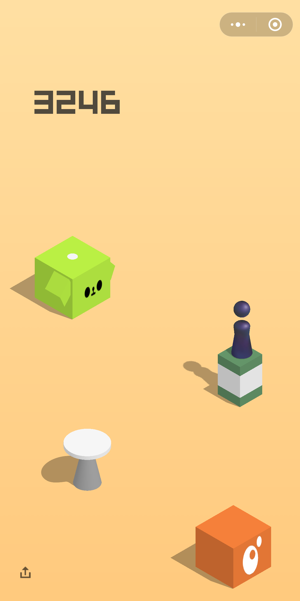
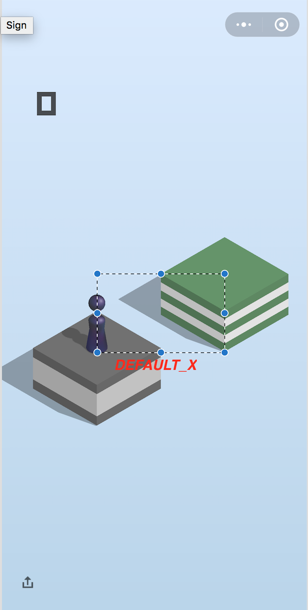

# JumpWechatGameSolver
Game Solver of Wechat "跳一跳"



#### Configuration (On top of jump.go)
* DEFAULT_T: first move time on ms
* DEFAULT_X: horizontal distance between pivot and center of next block.
* YMAX: screen width
* ADB_PATH: path of adb

see image for more detail.


#### Run:

```shell
go run jump.go
```

